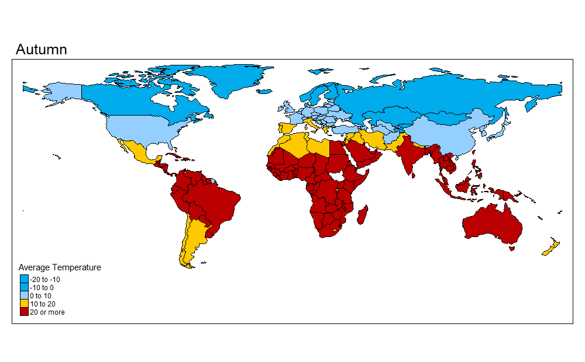
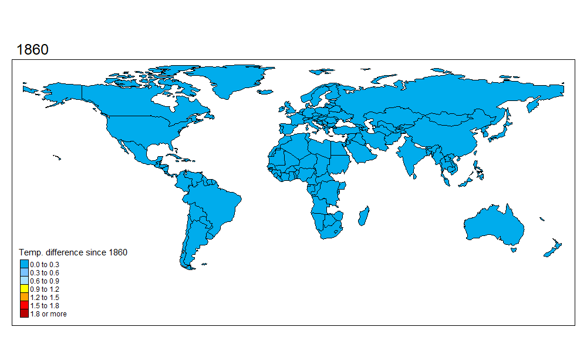

```{r setup, include=FALSE}
library(tidyverse)
library(readr)
library(lubridate)
require(maps)
library(countrycode)
library(ggalt)
library(leaflet)
library(tmap)
library(zoo)

knitr::opts_chunk$set(echo = FALSE, comment=NA, message=FALSE, comment="", warning=FALSE)
```

## Introduzione

Lo scopo dello studio è quello di analizzare la variazione di temperatura media dei paesi dall'anno 1860 al 2012 allo scopo di valutare l'intensità del cambiamento climatico sul nostro pianeta dall'inizio della seconda rivoluzione industriale.
Il dataset utilizzato per lo studio si chiama *Climate Change: Earth Surface Temperature Data* reperibile all'indirizzo [World Temperature Data](https://www.kaggle.com/berkeleyearth/climate-change-earth-surface-temperature-data).

## Dataset

Il dataset è strutturato in 4 colonne contententi nell'ordine la data di rilevazione della temperatura, la temperatura media rilevata, l'incertezza di misurazione ed infine il Paese nel quale è stata effettuata la rilevazione alle quali poi sono state aggiunte ulteriori colonne utili per i successivi studi.

Dataset:
```{r}

df <- read_csv("./data/GlobalLandTemperaturesByCountry.csv")
#SEPARATE DATE
df <- df %>% separate(dt, into = c("Year", "Month"), sep = "-") %>% mutate(Year=as.numeric(Year), Month=as.numeric(Month))
#ADD SEASON
df <- df %>% mutate(season = case_when(Month %in% 10:12 ~ "Autumn",
                                                     Month %in% 1:3 ~ "Winter",
                                                     Month %in% 4:6 ~ "Spring",
                                                     TRUE ~ "Summer"))
#ADD ISO CODE
df$iso_a3 <- countrycode(sourcevar = df$Country,
                             origin = "country.name",
                             destination = "iso3c")

#Update Country names
df$Country <- countrycode(sourcevar = df$iso_a3,
                             origin = "iso3c",
                             destination = "country.name")

#ADD CONTINENT
df$continent <- countrycode(sourcevar = df$Country,
                            origin = "country.name",
                            destination = "continent")

df <- df %>% drop_na()
head(df)
```


## Temperature medie attuali nei vari stati del mondo nel periodo 2002-2012


Temperatura media attuale del pianeta (°C):

```{r}
data("World")
temp_2002_2012 <- df %>% filter(Year %in% (2002:2012)) %>% group_by(iso_a3) %>% 
  summarise(AverageTemperature = as.numeric(format(round(mean(AverageTemperature), 1), nsmall = 1)))
World <- left_join(World, temp_2002_2012, by="iso_a3")
```

```{r}
format(round(mean(temp_2002_2012$AverageTemperature, na.rm = TRUE), 1))
```


Mappa temperature medie nel mondo
```{r out.width="100%"}
tmap_mode("view")
tm_shape(World) +
  tm_style("col_blind") +
  tm_fill("AverageTemperature", title = "Average Temperature", style = "fixed",
        breaks = c(-20, -10, 0, 10, 20, Inf),
        palette = c("#00ACEC", "#7AC3FF", "white", "yellow", "orange", "red", "#BA0000"), 
        showNA = FALSE) +
  tm_text("AverageTemperature", size = 0.9) +
  tm_borders()

```


## Temperature medie attuali nelle varie stagioni

```{r fig.align='center', fig.width=10}
season_temp_2002_2012 <- df %>% filter(Year %in% (2002:2012)) %>% group_by(season, continent) %>% summarise(AverageTemperature=mean(AverageTemperature, na.rm=TRUE))

seasons_levels <- c("Spring", "Summer", "Autumn", "Winter")

ggplot(data = season_temp_2002_2012, aes(x = continent, y = AverageTemperature, fill = factor(season, levels = seasons_levels))) +
  geom_bar(position = "dodge", stat = "identity") +
  geom_text(aes(label=format(round(AverageTemperature, 1))), position=position_dodge(width=0.9), 
            vjust=-0.5,color="black", fontface="bold") +
  scale_y_continuous(breaks = seq(0, 30, by = 2)) +
  scale_fill_brewer(palette = "Spectral") +
  labs(y= "Average temperature (°C)", x = "Continent") +
  theme_minimal() + 
  scale_fill_discrete(name = "Seasons") +
  theme(panel.grid.major=element_blank()) +
  theme(panel.border=element_blank()) +
  theme(axis.ticks=element_blank()) +
  theme(plot.title=element_text(face="bold")) +
  theme(plot.subtitle=element_text(face="italic", size=9, margin=margin(b=12))) +
  theme(plot.caption=element_text(size=7, margin=margin(t=12), color="#7a7d7e"))

```

```{r echo=FALSE, message=FALSE, comment="", results='hide'}
data("World")
temp_2002_2012 <- df %>% filter(Year %in% (2002:2012)) %>% group_by(iso_a3, season) %>% 
  summarise(AverageTemperature = as.numeric(format(round(mean(AverageTemperature), 1), nsmall = 1)))
World <- left_join(World, temp_2002_2012, by="iso_a3")
world_anim <- 
  tm_shape(World) +
  tm_facets(along = "season", free.coords = FALSE, showNA = FALSE) +
  tm_style("col_blind") +
  tm_fill("AverageTemperature", title = "Average Temperature", style = "fixed",
        breaks = c(-20, -10, 0, 10, 20, Inf),
        palette = c("#00ACEC", "#7AC3FF", "white", "yellow", "orange", "red", "#BA0000")) +
  #tm_text("AverageTemperature", size = 0.5) +
  tm_borders()

#world_anim 
tmap_animation(world_anim, filename = "season_world_anim.gif", delay = 100, width = 1000, height = 620)
```

Temperature medie nelle varie stagioni nel periodo 2002-2012

```{r}

```


## Variazione della temperatura media del pianeta tra il 1860 e il 2012

```{r echo=FALSE, fig.align="center", fig.width=10, fig.height=6}
library(zoo)
df_pond <- df %>% group_by(Year) %>% 
  summarise(AverageTemperature=mean(AverageTemperature, na.rm = TRUE),
            AverageTemperatureUncertainty=mean(AverageTemperatureUncertainty, na.rm = TRUE)) %>%
  mutate(AverageTemperature=rollmedian(AverageTemperature, k = 10,  fill = NA, align="right"),
         AverageTemperatureUncertainty=rollmedian(AverageTemperatureUncertainty, k = 10,  fill = NA, align="right")) %>% 
  filter(Year > 1758) %>%
  mutate(minAverageTemperature=AverageTemperature-AverageTemperatureUncertainty,
         maxAverageTemperature=AverageTemperature+AverageTemperatureUncertainty)


df_pond %>%
  filter(Year >= 1860, Year<=2012) %>%
  ggplot(aes(x=Year, y=AverageTemperature, ymin=minAverageTemperature, ymax=maxAverageTemperature)) +
  geom_line() + 
  geom_ribbon(alpha=0.25) +
  scale_x_continuous(breaks = seq(1700, 2012, by = 10)) + 
  scale_y_continuous(breaks = seq(4, 20, by = .2)) + 
  labs(x="Year", y="Average Temperature (°C)") +
  theme_minimal() + 
  theme(panel.border=element_blank()) +
  theme(axis.ticks=element_blank()) +
  theme(plot.title=element_text(face="bold")) +
  theme(plot.subtitle=element_text(face="italic", size=9, margin=margin(b=12))) +
  theme(plot.caption=element_text(size=7, margin=margin(t=12), color="#7a7d7e"))
```

```{r}
data("World")
av_temp_country_year <- df %>% filter(Year >= 1850) %>% group_by(Country, Year) %>%
  summarise(AverageTemperature=mean(AverageTemperature), iso_a3=unique(iso_a3)) %>%
  mutate(AverageTemperature=rollapply(AverageTemperature, 10, FUN=function(x) mean(x, na.rm=TRUE), 
                                      by.column=TRUE, partial=TRUE, fill=NA, align="right")) %>%
  filter(Year >= 1860) %>%
  mutate(diff_temp = AverageTemperature - first(AverageTemperature)) %>%
  filter(Year<=2012)
World <- left_join(World, av_temp_country_year, by="iso_a3")
```

```{r echo=FALSE, message=FALSE, comment="", results='hide'}
world_anim <- 
  tm_shape(World) +
  tm_facets(along = "Year", free.coords = FALSE, showNA = FALSE) +
  tm_style("col_blind") +
  tm_fill("diff_temp", title="Temp. difference since 1860", style = "fixed",
        breaks = c(0, 0.4, 0.8, 1.2, 1.4, 1.8, Inf),
        palette = c("#00ACEC", "#7AC3FF", "yellow", "orange", "red", "#BA0000"),
        colorNA = "gray") +
  tm_borders()

#world_anim 
tmap_animation(world_anim, filename = "world_anim.gif", delay = 10, width = 1000, height = 620)
```

Animazione della variazione di temperatura nel periodo 1860-2012

```{r}

```


Dal grafico si può notare che effettivamente in media la temperatura è costantemente aumentata nel periodo analizzato con una variazione nella media di circa 3°C (+17%) ai giorni nostri rispetto al 1860.

**Temperatura media periodo 1850-1860 e 2002-2012:**
```{r echo=FALSE, comment=""}
df_pond %>% filter(Year %in% c(1860,2012)) %>% select(Year, AverageTemperature)
```

**Variazione assoluta temperatura in °C:**
```{r echo=FALSE, comment=""}
temp_1860 = df_pond %>% filter(Year == 1860)
temp_2012 = df_pond %>% filter(Year ==2012 )
abs(temp_1860$AverageTemperature - temp_2012$AverageTemperature)
```

**Variazione percentuale temperatura:**
```{r echo=FALSE, comment=""}
var_perc <- ( temp_2012$AverageTemperature * 100)/temp_1860$AverageTemperature - 100
var_perc
```

L'aumento più vertigionoso si nota tra il 1870-1900, periodo di piena rivoluzione industriale e tra il 1970-2010, anni in cui la produzione di energia proveniente da combustibili fossili è aumentata del 140%, le emissioni dei trasporti sono aumentate del 120% e le emissioni delle industrie del 65% ([Fonte](https://www.ipcc.ch/site/assets/uploads/2021/03/ar4-wg3-spm-1.pdf)).


## Variazione della temperatura media nelle varie stagioni

```{r fig.align="center", fig.width=10, fig.height=4}
df %>% filter(Year>=1860) %>% 
  group_by(Year, season) %>% 
  summarise(AverageTemperature=mean(AverageTemperature, na.rm=TRUE)) %>% 
  na.omit() %>%
  ggplot(aes(x=Year, y=AverageTemperature)) + 
  geom_line(aes(colour=season)) + 
  scale_x_continuous(breaks = seq(1860, 2012, by = 20)) + 
  scale_y_continuous(breaks = seq(4, 40, by = 1)) +
  labs(x="Year", y="Average Temperature (°C)") + 
  scale_fill_discrete(name = "Seasons") +
  theme_minimal() + 
  theme(panel.border=element_blank()) +
  theme(axis.ticks=element_blank()) +
  theme(plot.title=element_text(face="bold")) +
  theme(plot.subtitle=element_text(face="italic", size=9, margin=margin(b=12))) +
  theme(plot.caption=element_text(size=7, margin=margin(t=12), color="#7a7d7e"))
```


## Variazione della temperatura media nei vari stati

```{r}
min_max <- df %>% filter(Year %in% (1850:1860) | Year %in% (2002:2012)) %>% 
  group_by(Country, Year = cut(Year, 2, labels=c("av_temp_1850_1860", "av_temp_2002_2012"))) %>% 
  summarise(AverageTemperature=mean(AverageTemperature, na.rm=TRUE), iso_a3=unique(iso_a3)) %>% 
  spread(Year, AverageTemperature) %>%
  mutate(diff_temp=as.numeric(format(round(av_temp_2002_2012-av_temp_1850_1860, 2), nsmall = 2))) %>%
  na.omit()

#min_max$region <- factor(min_max$region, levels = min_max$region[order(min_max$diff_temp)])
min_max <- min_max %>% arrange(-diff_temp)
min_max$Country <- factor(min_max$Country, levels = min_max$Country[order(min_max$diff_temp)])

```

```{r fig.width=10, fig.height=50}

fav_countries <- c("Italy", "France", "Germany", "Japan", "USA", "Spain")

ggplot(data = min_max) +
  geom_segment(aes(y=Country, yend=Country, x=-21, xend=31), color="#b2b2b2", size=0.15) +
  geom_dumbbell(aes(x=av_temp_1850_1860, xend=av_temp_2002_2012, y=Country), 
                size=1, color="#b2b2b2", size_x = 3, size_xend = 3, colour_x="#9fb059", colour_xend = "#edae52") +
  ##
  geom_text(data=min_max[1:1,],
                     aes(x=av_temp_1850_1860, y=Country, label="Temp. 1860"),
                     color="#9fb059", size=3, vjust=-2, nudge_x = -2, fontface="bold") +
  geom_text(data=min_max[1:1,],
                     aes(x=av_temp_2002_2012, y=Country, label="Temp. 2012"),
                     color="#edae52", size=3, vjust=-2, nudge_x = 2,fontface="bold") +
  ## TESTO SOTTO PALLINI
  geom_text(aes(x=av_temp_1850_1860, y=Country, label=format(round(av_temp_1850_1860, 1), nsmall = 1)),
                     color="#9fb059", size=2.75, vjust=1.5, hjust="right") +
  geom_text(aes(x=av_temp_2002_2012, y=Country, label=format(round(av_temp_2002_2012, 1), nsmall = 1)),
                     color="#edae52", size=2.75, vjust=1.5,hjust="left") +
  ## RECTANGLE
  geom_rect(aes(xmin=32, xmax=38, ymin=-Inf, ymax=Inf), fill="#efefe3") +
  geom_text(aes(label=sprintf("+%s °C", format(round(diff_temp, 2), nsmall = 2)), 
                y=Country, x=35), fontface="bold", size=3) +
  geom_text(data=min_max[1:1,], aes(x=35, y=Country, label="DIFF"),
                     color="#7a7d7e", size=3.1, vjust=-2, fontface="bold") +
  scale_y_discrete(expand=c(0.01,0)) +
  labs(x=NULL, y=NULL) +
  theme_bw() +
  theme(panel.grid.major=element_blank()) +
  theme(panel.grid.minor=element_blank()) +
  theme(panel.border=element_blank()) +
  theme(axis.ticks=element_blank()) + 
  theme(axis.text.x=element_blank()) +
  #theme(axis.text.y=element_text(colour=ifelse(min_max[order(nrow(min_max):1),]$Country %in% fav_countries, 
  #                                             "red", "black")))+
  theme(plot.title=element_text(face="bold")) +
  theme(plot.subtitle=element_text(face="italic", size=9, margin=margin(b=12))) +
  theme(plot.caption=element_text(size=7, margin=margin(t=12), color="#7a7d7e"))
```

## Mappa della variazione di temperatura fra il 1860 e il 2012

```{r out.width="100%"}
data("World")
World <- left_join(World, min_max, by="iso_a3")
tmap_mode("view")
tm_shape(World) +
  tm_style("col_blind") +
  tm_fill("diff_temp", title = "Temp. Difference", style = "fixed",
        breaks = c(0.8, 1.3, 1.8, 2.2, Inf),
        palette = c("yellow", "orange", "red"), 
        showNA = FALSE) +
  tm_text("diff_temp", size = 0.9) +
  tm_borders()
```

## Emissioni di CO2 nel periodo 1860-2012

Dataset utilizzato: [World CO2 Emissions](https://www.kaggle.com/srikantsahu/co2-and-ghg-emission-data).

```{r}
df_emissions <- read_csv("./data/EmissionData.csv")
df_emissions <- df_emissions %>% gather("Year", "Emissions", -1) %>% arrange(Country)
df_emissions$Year <- as.numeric(df_emissions$Year)
df_emissions$Emissions <- as.numeric(df_emissions$Emissions)
```

```{r fig.width=10, fig.height=5}
df_emissions_year <- df_emissions %>% filter(Country=="World")
emissions_vs_temp <- left_join(df_pond, df_emissions_year, by="Year") %>%
  filter(Year >= 1860, Year<=2012)

scale_ratio <- (max(emissions_vs_temp$AverageTemperature, na.rm = TRUE) - min(emissions_vs_temp$AverageTemperature, na.rm = TRUE)) /
  (max(emissions_vs_temp$Emissions, na.rm = TRUE) - min(emissions_vs_temp$Emissions, na.rm = TRUE))
dif <-  min(emissions_vs_temp$Emissions, na.rm = TRUE) - min(emissions_vs_temp$AverageTemperature, na.rm = TRUE)

ggplot(data=emissions_vs_temp, aes(Year)) +
  geom_line(aes(y=Emissions), size=1) +
  scale_x_continuous(breaks = seq(1700, 2012, by = 10)) +
  labs(x="Year", y="CO2 Emissions (Tons)") +
  theme_minimal() + 
  theme(panel.border=element_blank()) +
  theme(axis.ticks=element_blank()) +
  theme(plot.title=element_text(face="bold")) +
  theme(plot.subtitle=element_text(face="italic", size=9, margin=margin(b=12))) +
  theme(plot.caption=element_text(size=7, margin=margin(t=12), color="#7a7d7e"))
```


Aumento della produzione di CO2 nel mondo dal 1860 al 2012 in tonnellate:

```{r}
av_emissions_1860_2012 <- df_emissions_year %>% filter(Year %in% (1850:1860) | Year %in% (2002:2012)) %>% 
  group_by(Year = cut(Year, 2, labels=c(1860, 2012))) %>% 
  summarise(AverageEmissions=mean(Emissions, na.rm=TRUE)) %>%
  na.omit()

av_emissions_1860_2012 %>% filter(Year==1860 || Year==2012) %>% mutate(AverageEmissions=format(AverageEmissions, scientific = F))

```
Aumento della produzione di CO2 nel mondo dal 1860 al 2012 in percentuale:
```{r}
Ei = av_emissions_1860_2012 %>% filter(Year==1860) 
Ef = av_emissions_1860_2012 %>% filter(Year==2012)

((Ef$AverageEmissions-Ei$AverageEmissions)/Ei$AverageEmissions)*100
```


I primi 10 stati per quantità di CO2 prodotta dal 1860 al 2012

```{r}
not_countries = c("World", "EU-28", "Europe (other)", "Asia and Pacific (other)", "Americas (other)", "Middle East", "Africa")

df_emissions_country <- df_emissions %>% filter(!Country %in% not_countries) %>% group_by(Country) %>% 
  summarise(AverageEmissions=as.numeric(format(mean(Emissions, na.rm=TRUE),scientific = F))) %>% 
  mutate(em_rank=dense_rank(desc(AverageEmissions))) %>% arrange(em_rank)
head(df_emissions_country, 10)
```


Correlazione tra aumento di emissione di CO2 e aumento di Temperatura del pianeta:

```{r}
cor(emissions_vs_temp$Emissions, emissions_vs_temp$AverageTemperature)
```


# I Paesi con la maggior crescita di temperatura sono quelli che inquinano di più?

## NO!

Correlazione tra emissione di CO2 e aumento di temperatura nel Paese di emissione:
```{r}
df_emissions_country_year <- read_csv("./data/EmissionData.csv")
df_emissions_country_year <- df_emissions_country_year %>% gather("Year", "Emissions", -1) %>% arrange(Country)
df_emissions_country_year$Year <- as.numeric(df_emissions_country_year$Year)
df_emissions_country_year$Emissions <- as.numeric(df_emissions_country_year$Emissions)
df_emissions_country_year <- as.data.frame(df_emissions_country_year)
df_emissions_country_year <- df_emissions_country_year %>% filter(Year>=1860, Year<=2012)
df_emissions_country_year <- df_emissions_country_year %>% group_by(Country) %>% 
  summarise(total_emissions_1970_2012=sum(Emissions))

emissions_vs_temp_country <- left_join(min_max, df_emissions_country_year)
emissions_vs_temp_country <- emissions_vs_temp_country[complete.cases(emissions_vs_temp_country),]
cor(emissions_vs_temp_country$diff_temp, emissions_vs_temp_country$total_emissions_1970_2012)
```
Tabella di confronto emissioni/rank nei vari paesi

```{r}
diff_temp_vs_rank <- left_join(min_max, df_emissions_country) %>%
  na.omit()

head(diff_temp_vs_rank %>% select(-iso_a3), 10)
```

